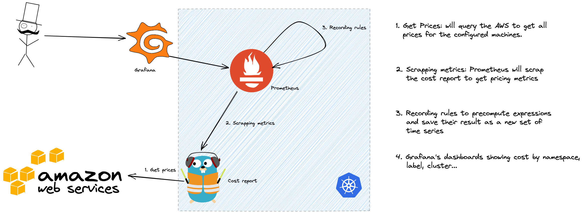

# Cost Reports
<a href='https://github.com/jpoles1/gopherbadger' target='_blank'></a>

## Architecture

## Requirements

```sh
brew install go
```

## Build

```sh
go build 
## Docker 

For those who wants keep it simple and avoid install a lot of things:

```sh
docker build . -t cost-report
docker run -p 8080:8080 cost-report
```

## Usage


### Keep it simple


### Start using it
1. Add comments to your API source code, [See Declarative Comments Format](https://swaggo.github.io/swaggo.io/declarative_comments_format/).
2. Download [Swag](https://github.com/swaggo/swag) for Go by using:
```sh
$ go get -u github.com/swaggo/swag/cmd/swag
```

3. Run the [Swag](https://github.com/swaggo/swag) in your Go project root folder which contains `main.go` file, [Swag](https://github.com/swaggo/swag) will parse comments and generate required files(`docs` folder and `docs/doc.go`).
```sh
$ swag init
```
4. Run Cost Report API 
```sh 
$ go run main.go
```


5. Endpoints

- Metrics: localhost:8080/metrics
- Healthcheck: localhost:8080/health
